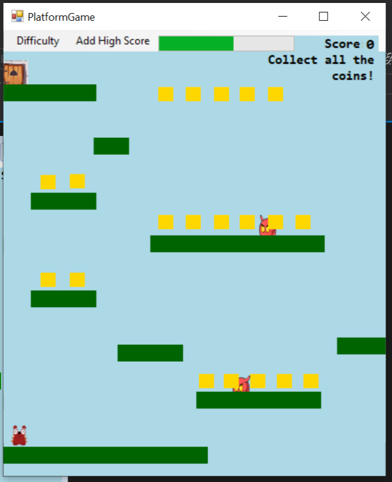
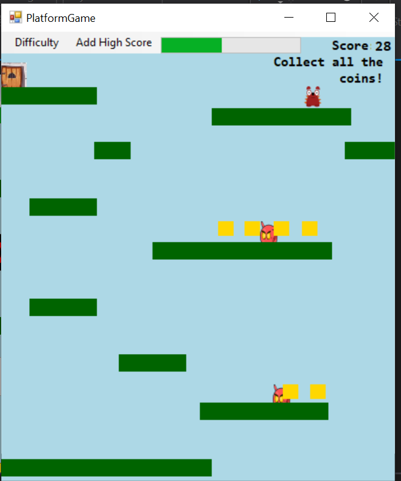
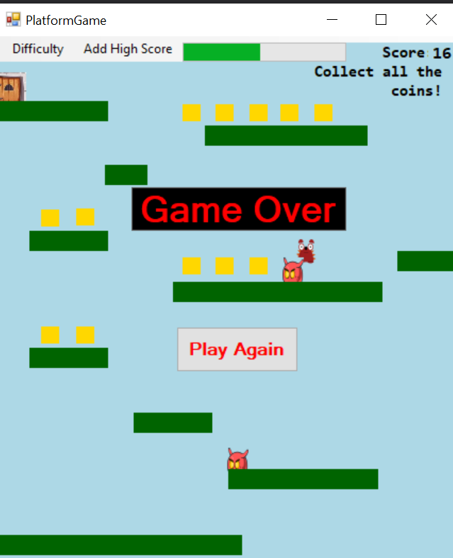
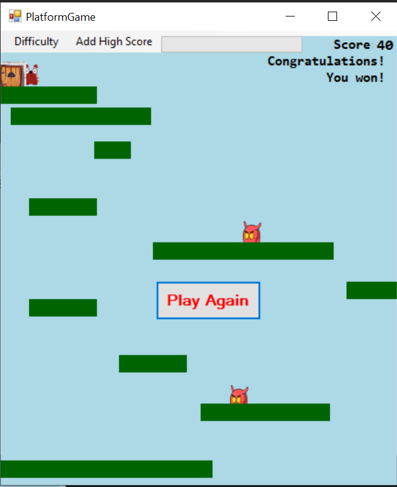
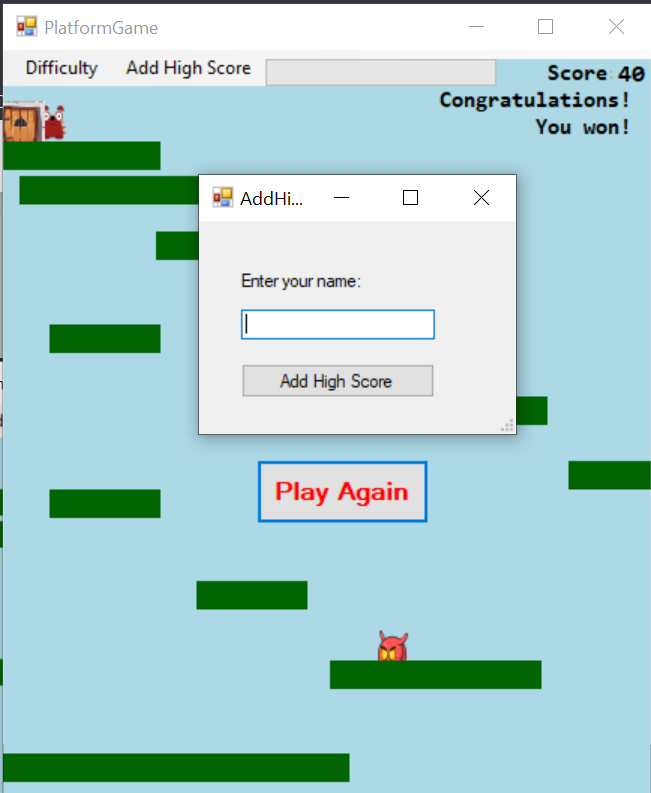
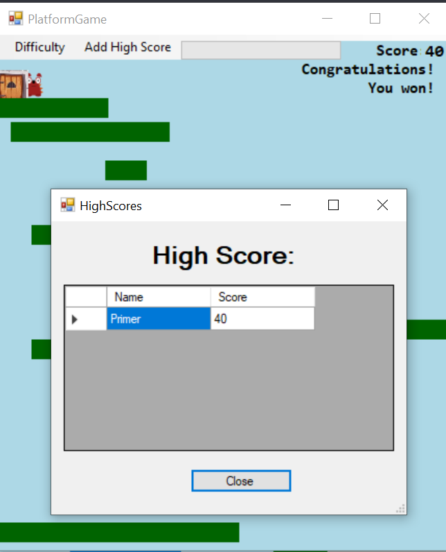

# PlatformGameVP

1.Објаснување на проблемот 

Platform game претставува игра налик на Super Mario, каде што играчот има за цел да стигне до крајот односно до вратата која се наоѓа најгоре во десниот агол. Притоа, играчот мора да ги собере сите парички што се наоѓаат околу него, но и да внимава да не допре некој од движечките непријателски чудовишта кои се поставени на платформите околу. 

Освен ова, играчот мора да биде доволно брз и да стигне до вратата собирајќи ги сите парички пред да истече времето кое е поставено во горниот дел во вид на progress bar кој што се намалува како што тече времето, додека пак како трета опција која може да доведе до крај на играта е доколку играчот испадне од прозорецот.

Постојат и две платформи кои се движат хоризонтално и вертикално со различни брзини со цел да му отежнат на играчот да стигне до вратата.

Играта има 3 нивоа на тежина кои што играчот може да ги одбере: Easy, Medium и Hard

Тежините се разликуваат по брзините кои ги имаат непријателските чудовишта и платоформите кои што се движат, при easy ниво на тежина тие се најспори, на medium малку побрзи и hard најбрзи соодветно. Исто така бројот на освоени поени се разликува по видот на нивото кое што се игра, една паричка на easy носи 1 поен, на medium 2 и на hard 3 поена.

2.Решението на проблемот (кои податоци се чуваат, во какви структури, класи)

Визуелно играта има повеќе платформи на кои што играчот треба да пристапи и да ги собере паричките. За реализација на тие платформи е искористено PictureBox и на сите тие платформи им е поставена позадинска боја и platform tag. На платформите што се движат им е доделено име verticalPlatform и horizontalPlatform соодветно. Паричките се исто така  PictureBox и имаат coin tag. Најглавен во целата приказна е играчот за кој што е доделено име player и тој е главен иницијатор на сите промени, тука се и непријателите кои се движат.

3.Да се опише барем една ваша функција или класа од изворниот код на проектот
if (player.Bounds.IntersectsWith(door.Bounds) && coinCount == 20)
            {
               // WriteHighScore();
                timer1.Stop();
                progressBar1.Value = 0;
                gameTimer.Stop();
                isGameOver = true;
                PlayAgain_button.Visible = true;
                txtScore.Text = "Score: " + score + Environment.NewLine + "Congratulations! You won!";
                }
 //vo sprotivno stoi porakata da gi sobere i preostanatite coins
 else
     {
         txtScore.Text = "Score: " + score + Environment.NewLine + "Collect all the coins!";
     }
Оваа функција е служи за победата на играчот односно играчот победува само доколку стигне до вратата и ги собере сите парички чии вкупен број е 20. CoinCount е променлива која што првично е иницијализирана на 0 а потоа со секоја интеракција на играчот со паричките се зголемува за 1. Сето тоа се проверува во условот if и доколку е исполнето најглавно нешто што треба да се направи е да му се прикаже визуелна порака на играчот дека успешно завршил и исто така можност за играње повторно(play button) покрај се стопираат двата тајмери од кои што едниот служи за прогрес барот(timer1). Исто така променливата isGameOver се иницијализира на true бидејќи играта завршува и во овој случај завршува успешно. Во спротивно доколку играчот не стигне до вратата или не ги собере сите парички му се прикажува во горниот десен агол колку е вкупниот број на освоени парички и порака дека треба да ги собере сите.

4.Упатство и контроли
← → ↑ ↓ - движење
space - скокање

Соберете ги сите парички пред да истече времето и стигнете до вратата, без да допрете ниту едно од непријателските чудовишта.

Во позадина додека играта е вклучена може да се слушне и позадинаска музика со цел да го направи корисничкото искуство поубаво

5.Screenshots

